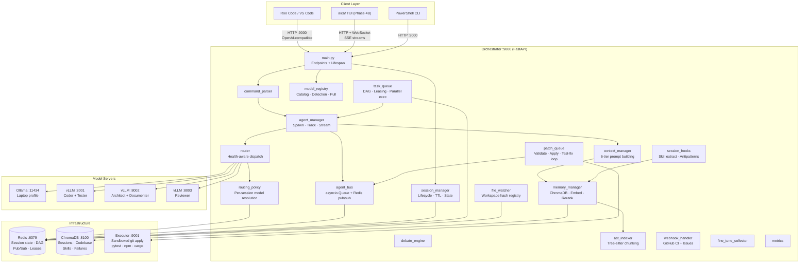
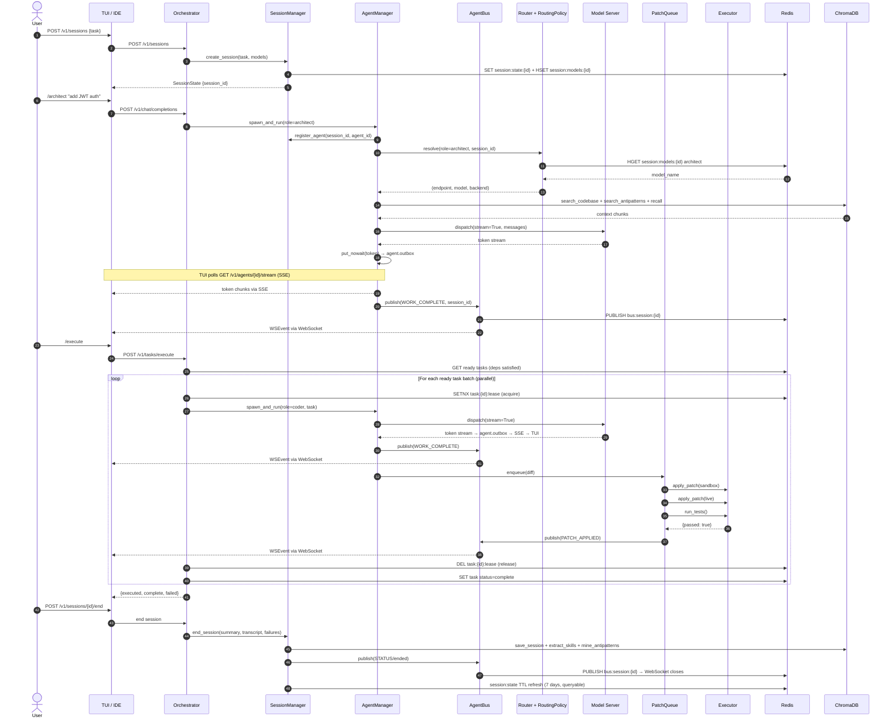
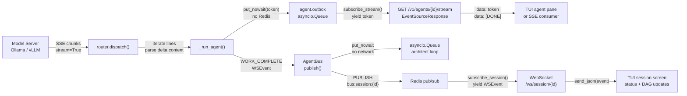

# 🏭 AI Coding Agent Factory

> A fully local, Dockerized, multi-agent AI coding system powered by open-weight Qwen models.

[](https://github.com/harshD42/ai-coding-agent-factory/actions/workflows/ci.yml)
[](LICENSE)
[](docs/phase-roadmap.md)
[](https://github.com/harshD42/ai-coding-agent-factory/releases)

---

## What Is This?

AI Coding Agent Factory is a self-hosted, privacy-first multi-agent coding assistant. It runs entirely on your own hardware — no API keys, no cloud, no data leaving your machine.

You interact through VS Code (Roo Code extension), a terminal CLI, or the native `aicaf` TUI (Phase 4B). Behind the scenes, an orchestrator routes your requests to specialized AI agents (architect, coder, reviewer, tester, documenter), manages persistent sessions, streams tokens in real time, enforces patch-based file editing, runs tests automatically, and learns from failures over time.

**Core principle:** Agents are dumb workers. The orchestrator is the brain. Your IDE or terminal is the UI.

---

## Features

**Multi-agent pipeline** — Architect plans, Coder implements, Reviewer critiques, Tester writes tests, Documenter writes docs. Each role has its own system prompt, isolated memory, and dedicated model assignment.

**Persistent sessions** — Sessions are Redis-backed and survive orchestrator restarts. Session state, model assignments, agent IDs, and task IDs are all tracked and queryable.

**Real-time token streaming** — Tokens flow from model → agent outbox → SSE endpoint → TUI agent pane with no Redis in the hot path. Each agent has a dedicated SSE stream at `GET /v1/agents/{id}/stream`.

**Agent message bus** — Structured events (work complete, patch applied, test result) flow over a dual-transport bus: `asyncio.Queue` in-process for agent→architect coordination, Redis pub/sub for WebSocket→TUI fan-out.

**Dynamic model assignment** — Each session can override which model each role uses via `POST /v1/session/configure`. Profile defaults apply when no override is set.

**Debate engine** — Architect and Reviewer debate plans for up to N rounds before execution begins.

**Dependency-aware task DAG** — Tasks execute in topological order with Redis-backed state and task leasing (prevents duplicate execution on restart). Independent tasks run concurrently.

**Patch-based editing** — Agents produce unified diffs, never raw files. Every patch is validated against the workspace before applying.

**Automatic test-fix loop** — After a patch applies, pytest runs automatically. If tests fail, the failure is fed back to the coder for a fix diff, up to `MAX_FIX_ATTEMPTS` times.

**AST-aware codebase indexing** — Python, JS, TS, Go, Rust, Java, C, C++ files are indexed at function/class boundaries using tree-sitter. Agents get complete, meaningful code units as context.

**Failure pattern learning** — After enough similar failures accumulate, the system automatically extracts "what not to do" skills and injects them into future agent prompts as known pitfalls.

**Fine-tune data collection** — Every successful (patch applied + tests pass) session is recorded as a training example. Export via `GET /v1/finetune/export` for offline LoRA fine-tuning.

**GitHub CI/CD integration** — Connect your repo's webhook to auto-fix failing CI or decompose new issues into task DAGs.

**Hardware adaptive** — Laptop (Ollama 7B), single GPU (24GB+), multi-GPU server (3× dedicated models). `PROFILE=auto` detects your hardware at startup.

**Fully local** — All models run on your hardware via Ollama or vLLM.

---

## Architecture

### Component Map



---

### Request Sequence — `/architect` + `/execute`



---

### Streaming Token Path



---

## Quick Start

### Prerequisites
- Docker + Docker Compose v2
- 8GB RAM minimum (16GB recommended for laptop profile)
- NVIDIA Container Toolkit (for GPU profiles only)

### 1. Clone

```bash
git clone https://github.com/harshD42/ai-coding-agent-factory.git
cd ai-coding-agent-factory
```

### 2. Configure

```bash
cp .env.example .env
# Edit .env — set PROFILE and PROJECT_PATH at minimum
```

### 3. Launch

```bash
# Laptop / CPU
docker compose --profile laptop up -d

# Single GPU (24GB+)
docker compose --profile gpu-shared up -d

# Multi-GPU server
docker compose --profile gpu up -d
```

### 4. Point at your project

```bash
# In .env:
PROJECT_PATH=/path/to/your/project

# Restart and re-index
docker compose restart executor orchestrator
curl -X POST http://localhost:9000/v1/index
```

### 5. Connect your IDE

**Roo Code (VS Code):**
- API Provider: `OpenAI Compatible`
- Base URL: `http://localhost:9000/v1`
- API Key: `local`
- Model ID: `orchestrator`
- Mode: **Chat**

**Open WebUI:** `http://localhost:3000` (add `--profile monitor` to compose command)

### 6. Use it

```
/architect "add JWT authentication to the API"
/execute
/status
/memory "rate limiting"
/index
```

---

## Hardware Profiles

| Profile | Command | Min VRAM | Models |
|---------|---------|----------|--------|
| `laptop` | `--profile laptop` | 0 (CPU) / 8GB | Ollama qwen2.5-coder:7b (all roles) |
| `gpu-shared` | `--profile gpu-shared` | 48GB | vLLM Qwen3-Coder-Next-80B (all roles) |
| `gpu` | `--profile gpu` | 80GB+ across 3 GPUs | Dedicated model per role |

Set `PROFILE=auto` in `.env` to detect hardware automatically at startup. The decision is logged at `WARNING` level so it's always visible in orchestrator startup logs.

See [docs/hardware-requirements.md](docs/hardware-requirements.md) for full VRAM breakdown.

---

## Available Commands

| Command | Description |
|---------|-------------|
| `/architect <task>` | Generate implementation plan |
| `/debate <topic>` | Architect vs Reviewer debate |
| `/review <text>` | Review code or plan |
| `/test <task>` | Write tests |
| `/execute` | Execute task queue (parallel, DAG-ordered) |
| `/memory <query>` | Search past sessions |
| `/learn` | Extract reusable skill from current session |
| `/status` | System health · metrics · models · sessions |
| `/index` | Re-index codebase (AST-aware, incremental) |

---

## Session & Streaming API (Phase 4B)

### Create a managed session

```bash
curl -X POST http://localhost:9000/v1/sessions \
  -H "Content-Type: application/json" \
  -d '{"task": "Add JWT authentication", "models": {"coder": "qwen2.5-coder:7b"}}'
```

### Stream agent tokens (SSE)

```bash
curl -N http://localhost:9000/v1/agents/{agent_id}/stream
# → data: def authenticate(
# → data: token: str
# → data: [DONE]
```

### WebSocket session events

```javascript
const ws = new WebSocket('ws://localhost:9000/ws/session/{session_id}');
ws.onmessage = (e) => {
  const event = JSON.parse(e.data);
  // event.type: work_complete | patch_applied | test_result | status | ...
};
```

### Send message to specific agent

```bash
curl -X POST http://localhost:9000/v1/agents/{agent_id}/message \
  -H "Content-Type: application/json" \
  -d '{"message": "focus on the auth middleware only", "sender": "user"}'
```

---

## GitHub Webhook Setup (Optional)

Connect your repo to auto-fix failing CI and decompose issues:

1. Go to your repo → Settings → Webhooks → Add webhook
2. Payload URL: `http://your-server:9000/v1/webhook/github`
3. Content type: `application/json`
4. Secret: set a random string, copy it to `GITHUB_WEBHOOK_SECRET` in `.env`
5. Events: select `Workflow runs` and `Issues`
6. Set `GITHUB_TOKEN` in `.env` (PAT with `repo:read`, `actions:read`)
7. Set `GITHUB_REPO=owner/repo` in `.env`

---

## Project Structure

```
ai-coding-agent-factory/
├── docker-compose.yml            # Full stack definition (3 profiles)
├── .env.example                  # Configuration template
├── Makefile                      # make up/down/test/lint/index/status
├── executor/
│   ├── Dockerfile
│   ├── requirements.txt
│   └── main.py                   # Sandboxed command runner
├── orchestrator/
│   ├── Dockerfile
│   ├── requirements.txt
│   ├── main.py                   # FastAPI app + all endpoints (v0.5.0)
│   ├── config.py                 # All env vars + profile detection
│   ├── router.py                 # Health-aware model routing
│   ├── routing_policy.py         # Per-session model resolution (Phase 4A.2)
│   ├── model_registry.py         # Model catalog + detection + pull (Phase 4A.1)
│   ├── session_manager.py        # Session lifecycle + Redis state (Phase 4B.1)
│   ├── agent_bus.py              # Dual-transport message bus (Phase 4B.3)
│   ├── agent_manager.py          # Spawn · track · stream · inbox/outbox
│   ├── context_manager.py        # 6-tier prompt building + antipatterns
│   ├── memory_manager.py         # ChromaDB + embedding + reranker + symbols
│   ├── ast_indexer.py            # Tree-sitter AST chunking
│   ├── patch_queue.py            # Diff validation + test-fix loop
│   ├── task_queue.py             # Redis DAG + leasing + parallel execution
│   ├── debate_engine.py          # Multi-round debate
│   ├── models.py                 # Pydantic schemas incl. WSEvent
│   ├── skill_loader.py           # Markdown skills → prompts
│   ├── session_hooks.py          # Lifecycle + failure pattern mining
│   ├── file_watcher.py           # watchdog workspace monitor
│   ├── webhook_handler.py        # GitHub CI/issue webhook
│   ├── fine_tune_collector.py    # Training data JSONL collection
│   ├── gateway.py                # LiteLLM gateway (USE_LITELLM=true, optional)
│   ├── metrics.py                # Token + latency tracking
│   ├── executor_client.py        # HTTP client for executor
│   ├── command_parser.py         # /command detection
│   └── utils.py                  # Shared utilities
├── agents/                       # Agent system prompts (markdown)
├── skills/                       # Domain knowledge (add yours here)
├── rules/                        # Always-on coding rules
├── cli/
│   └── agent.ps1                 # PowerShell CLI
├── tests/
│   ├── unit/                     # 475+ unit tests, no Docker needed
│   └── integration/              # Smoke tests, requires running stack
└── docs/
    ├── api-reference.md
    ├── architecture.md
    ├── deployment.md
    ├── hardware-requirements.md
    ├── phase-roadmap.md
    └── skills-guide.md
```

---

## Roadmap

| Phase | Version | Status | Description |
|-------|---------|--------|-------------|
| **Phase 1** | v0.1.0 | ✅ Complete | Foundation: agents, memory, DAG, debate, patches |
| **Phase 2** | v0.2.0 | ✅ Complete | Auto-patching, test runner, parallel execution, metrics |
| **Phase 3** | v0.3.0 | ✅ Complete | AST indexing, CI webhook, fine-tune collection, failure learning |
| **Phase 3.5** | v0.3.5 | ✅ Complete | Stability pass: history trim, LRU cache, patch deque, router timeout |
| **Phase 4A** | v0.4.x | ✅ Complete | Model registry, dynamic routing, vLLM validation, LiteLLM gateway |
| **Phase 4B** | v0.5.0 | ✅ Complete | Persistent sessions, token streaming, agent bus, WebSocket |
| **Phase 4B.4** | v0.5.x | 🔲 In Progress | `aicaf` TUI — native terminal interface |
| **Phase 5** | v0.6.0 | 🔲 Planned | Postgres persistence, NATS bus, Qdrant, multi-user, observability |

See [docs/phase-roadmap.md](docs/phase-roadmap.md) for full details.

---

## Contributing

See [CONTRIBUTING.md](CONTRIBUTING.md).

## License

[Apache 2.0](LICENSE) — matches the Qwen model family license.